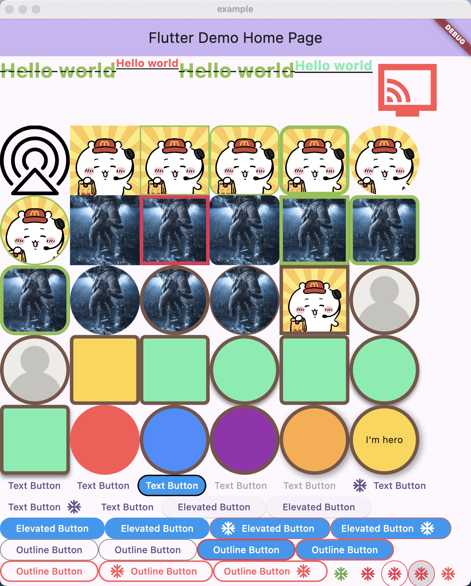

# flutter_tailwind

I hope to make something like tailwind that can simplify the description of style and improve efficiency.

## Getting Started

This project is a starting point for a Flutter application.

A few resources to get you started if this is your first Flutter project:

- [Lab: Write your first Flutter app](https://docs.flutter.dev/get-started/codelab)
- [Cookbook: Useful Flutter samples](https://docs.flutter.dev/cookbook)

For help getting started with Flutter development, view the
[online documentation](https://docs.flutter.dev/) which offers tutorials,
samples, guidance on mobile development, and a full API reference.
## ScreenShot



### Text
> create a text like below
```dart
"Hello world".text.dashed.lightGreen.f30.bold.lineThrough.mk
"Hello world".text.styleMain.mk
"Hello world".text.styleTest.mk
"Hello world".text.styleAccent.mk
```
### IconDatas
```dart
Icons.connected_tv_sharp.icon.redAccent.s100.mk
```
### Svg
```dart
 R.icAirPlay.svg.black.s100.mk
```
### Image
> create image,asset image use flutter native widget like Image.asset,and file use Image.file,and network image use CacheNetworkImage
```dart 
R.icDefPlaylist.asset.s100.mk
R.icDefPlaylist.asset.border2.borderLightGreen.s100.mk
R.icDefPlaylist.asset.border2.borderLightGreen.rounded16.s100.mk
R.icDefPlaylist.asset.border5.borderLightGreen.rounded16.s100.mk
R.icDefPlaylist.asset.s100.circle.mk
R.icDefPlaylist.asset.s100.circle.border2.borderLightGreen.mk
_link.image.s100.mk
_link.image.borderPink.border5.s100.mk
_link.image.rounded12.s100.mk
_link.image.borderLightGreen.border5.s100.mk
_link.image.borderLightGreen.border5.rounded12.s100.mk
_link.image.borderLightGreen.border5.rounded22.s100.mk
_link.image.circle.s100.mk
_link.image.border5.borderBrown.circle.s100.mk
_link.image.border2.borderBrown.circle.s100.mk
"https://gd-hbimg.huaban.com/".image.border5.borderBrown.s100.mk
"https://gd-hbimg.huaban.com/".image.border5.borderBrown.circle.s100.mk
"werwe".image.border5.borderBrown.circle.s100.mk
```
### Container
```dart 
container.s100.circle.orangeAccent.borderBrown.cardShadow.border5.mk
container.s100.circle.amberAccent.borderBrown.cardShadow.center.border5.child(const Text("I'm hero")) 
```

### Button
```dart
"Text Button".textButton.textWhite.redAccent.borderGreen.click()
"Text Button".textButton.yellow.rounded8.borderGreen.click()
"Text Button".textButton.yellow.icon(Icons.ac_unit).rounded8.borderGreen.click(onTap: () {})
"Text Button".textButton.yellow.icon(Icons.ac_unit).end.rounded8.borderGreen.click(onTap: () {})
"Text Button".textButton.textColor(Colours.redAccent).rounded8.borderGreen.click(onTap: () {})
'Elevated Button'.elevatedButton.blue.textWhite.click()
'Elevated Button'.elevatedButton.icon(Icons.ac_unit).blue.borderRedColor.textWhite.click()
'Elevated Button'.elevatedButton.icon(Icons.ac_unit).end.blue.borderRedColor.textWhite.click()
"Outline Button".outlinedButton.borderRedColor.textWhite.blue.border2.click(onTap: () {})
"Outline Button".outlinedButton.borderRedColor.border2.click(onTap: () {})
"Outline Button".outlinedButton.icon(Icons.ac_unit).borderRedColor.border2.click(onTap: () {})
"Outline Button".outlinedButton.icon(Icons.ac_unit).end.borderRedColor.border2.click(onTap: () {})
Icons.ac_unit.iconButton.green.click(onTap: () {})
Icons.ac_unit.iconButton.red.click(onTap: () {})
Icons.ac_unit.iconButton.borderRed.click(onTap: () {})
Icons.ac_unit.iconButton.borderRed.black12.click(onTap: () {})
Icons.ac_unit.icon.redAccent.iconClick(onTap: () {})
R.icAirPlay.svg.black.s24.iconClick(onTap: () {})
```

### ListView
```dart 
listview.neverScroll.shrinkWrap.horizontal.h50.builder(10, _itemBuilder)
listview.neverScroll.shrinkWrap.horizontal.h50.reverse.builder(10, _itemBuilder)
listview.neverScroll.shrinkWrap.horizontal.divider.h50.builder(10, _itemBuilder)
listview.neverScroll.shrinkWrap.horizontal.divider.h50.reverse.builder(10, _itemBuilder)
listview.neverScroll.shrinkWrap.reverse.builder(3, _itemBuilder)
listview.neverScroll.shrinkWrap.divider.builder(3, _itemBuilder)
listview.neverScroll.shrinkWrap.separated(const Divider(color: Colors.red)).builder(3, _itemBuilder)

///set the step widget,every 3 step ,will show a text
listview.neverScroll.shrinkWrap.divider.step3.builder(
  10,
  (_, index) => Text("child: $index", style: ts.f30.bold.redAccent.mk)
  stepBuilder: (_, index) => container.red.centerLeft.p8.pl16.child("banner:$index".text.bold.f20.white.mk)
)

listview.separated16.pl16.pr16.horizontal.h365.builder(
  10,
  (_, __) => const SizedBox(width: 250, child: PostItem())
)
listview.separated(h16).p16.neverScroll.shrinkWrap.builder(2, (_, __) => const PostItem())
listview.separated16.pl16.pr16.neverScroll.shrinkWrap.builder(2, (_, __) => const PostItem())
listview.divider.pl16.pr16.pt16.neverScroll.shrinkWrap.builder(2, (_, __) => const PostItem())
listview.pl16.pr16.pt16.neverScroll.shrinkWrap
.separated(Divider(color: Colors.red, height: 16.h, thickness: 16.h))
     .dataBuilder<int>(
   [1, 2, 3],
   (_, __, item) => const PostItem()
)
```

### GridView
```dart
gridview.neverScroll.crossAxisCount3.spacing8.p8.shrinkWrap.builder(
5,
(_, __) => _link.image.border2.borderRed.circle.s50.mk,
),
gridview.neverScroll.crossAxisCount4.spacing8.p8.shrinkWrap.reverse.builder(
8,
(_, __) => _link.image.border2.rounded8.s50.mk,
),

///set the step widget,every 3 step ,will show a red container,if don't setting the stepBuilder ,even you set the step is useless
gridview.neverScroll.childWidth50.step4.spacing8.p8.shrinkWrap.builder(
16,
(_, __) => _link.image.border2.rounded8.s50.mk,
stepBuilder: (_, __) => container.rounded8.red.center.child("Ads".text.white.mk),
), 
```